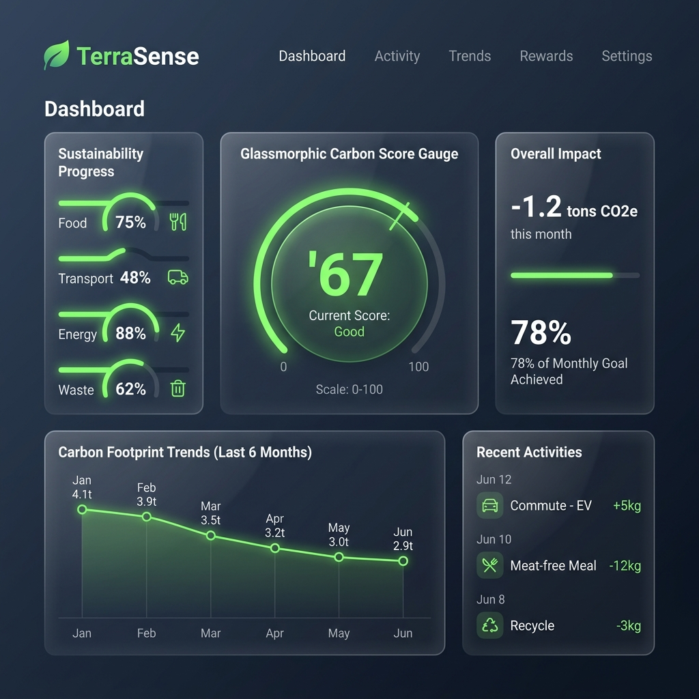
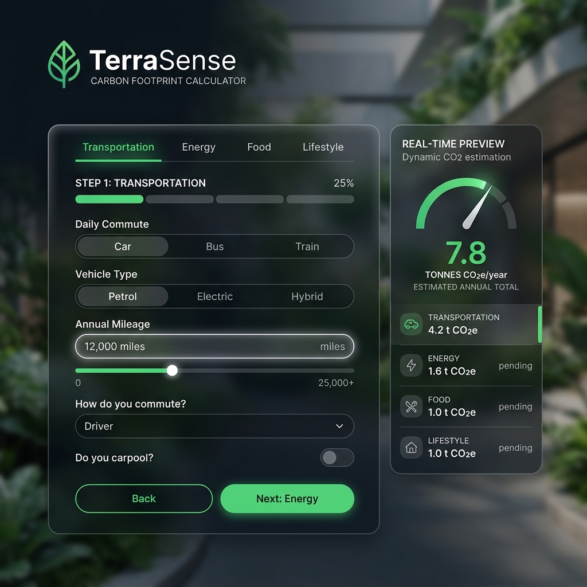

# TerraSense - AI-Powered Carbon Footprint Awareness Platform

TerraSense is a production-ready, full-stack web application designed to help users track, understand, and reduce their environmental impact. By logging habits across transportation, utility consumption, food, water, and waste generation, users receive real-time footprint estimates, linear carbon forecasting, national average comparisons, custom AI sustainability advice, and printable achievement credentials.

---

## 1. Problem Statement
Climate change is the defining crisis of our time, and individual choices collectively account for over 70% of global greenhouse gas emissions. However, most individuals lack the tools to measure, visualize, and systematically reduce their personal impact. Existing carbon calculators are often overly complex, static, and fail to provide actionable, localized advice or interactive community challenges. 

**TerraSense** bridges this gap by providing an intuitive, interactive carbon accounting portal with real-time feedback, predictive forecasting, gamified challenges, and printable AI sustainability audits.

---

## 2. Screenshots

Here are mockup screenshots of the TerraSense user interface:

### Analytics Dashboard


### Carbon Footprint Calculator Wizard


---

## 3. Features

- **Accurate Footprint calculations**: Multi-step wizard logging parameters across:
  - *Transportation*: Car, bus, train, flight, bike.
  - *Utilities*: Electricity, gas, heating oil, water consumption.
  - *Food*: Vegetarian, non-vegetarian, vegan meals.
  - *Lifestyle & Waste*: Clothing, electronics, shipping packages, waste kg.
- **Real-Time CO2 Preview**: An active preview bar that calculates emission totals instantly as sliders and number inputs are adjusted.
- **Footprint Forecasting**: Employs linear regression history projections to forecast next month's carbon footprint.
- **National Average Comparisons**: Benchmarks user emissions against averages for the US, UK, India, and global per capita averages.
- **Eco Challenges Portal**: Claims weekly points (+150-200 pts) for completing active sustainability goals (No-Plastic, Public Transit, Energy-Saving, 10% Reduction).
- **Gamified Achievements**: Renders level systems, community leaderboards, logging streaks, and milestone badges (First Step, Green Guardian, Sustainability Champion, Eco Scholar, Habit Changer).
- **AI-Generated Sustainability Reports & Certificates**: Generates custom narrative sustainability reports and printable credentials. Handles print stylesheets wrapper for PDF printing via `window.print()`.
- **Accessibility (A11y)**: WCAG 2.1 AA compliant, supporting screen reader aria-labels, high contrast HSL themes (Light/Dark mode), and keyboard focus outline navigation.
- **Dark & Light Mode Toggle**: Sleek interface supporting both settings, persistent via local storage.

---

## 4. Tech Stack

- **Frontend**: React.js (Vite), Tailwind CSS/Custom HSL themes, Lucide React Icons, Custom SVG Charts (no canvas/external layout engine dependencies).
- **Backend**: Node.js + Express.js
- **Database**: SQLite (using `sqlite3` driver)
- **Session Auth**: JWT (JSON Web Tokens) + Bcryptjs password hashing

---

## 5. Setup Instructions

### Prerequisites
- Node.js (v18.0.0 or higher)
- npm (v9.0.0 or higher)

### 1. Run the Backend
```bash
cd Backend
npm install
npm run dev
```
*The backend server will run on `http://localhost:5000`.*

### 2. Run the Frontend
Open a new terminal window:
```bash
cd Frontend
npm install
npm run dev
```
*The Vite React client will run on `http://localhost:5173`.*

### Running Tests
To run unit and integration tests:
```bash
cd Backend
npm test
```

---

## 6. API Endpoints

All API routes require a `Bearer <token>` in the `Authorization` header, except for public registration/login endpoints.

### Authentication
- `POST /api/auth/register` - Registers a new user. Returns JWT token and profile details.
- `POST /api/auth/login` - Validates credentials. Returns JWT token.
- `GET /api/auth/me` - Returns logged-in user profile, points, and reduction target.
- `PUT /api/auth/profile` - Updates profile parameters (name, location, target, interests).

### Calculator & Analytics
- `POST /api/calculations` - Log monthly parameters. Saves to database and returns CO2 metrics.
- `GET /api/calculations/history` - Fetches all calculations sorted by date descending.
- `GET /api/calculations/summary` - Computes baseline comparisons, emission scores, predictions, and national averages.

### AI Recommendations
- `GET /api/recommendations` - Computes highest-impact categories and yields custom tips.
- `POST /api/recommendations/adopt` - Set recommendation status (`none` | `in_progress` | `adopted`). Awards +100 points on adoption completion.

### Gamification & Leaderboard
- `GET /api/leaderboard` - Standings sorted by CO2 reduction percentage relative to baseline.
- `GET /api/leaderboard/badges` - Fetches earned and locked badges status.
- `POST /api/leaderboard/claim-challenge` - Claim +150-200 points for satisfying active challenges.

### Educational Hub
- `GET /api/educational` - Fetches sustainability articles and read markers.
- `POST /api/educational/read` - Logs article completion. Awards +25 points.

---

## 7. Future Scope
- **IoT Smart Meter Integration**: Connect utility electricity metrics directly to smart home thermostats for real-time tracking.
- **Verified Offsets Integration**: Link users with verified carbon offset projects (like reforestation or wind farms) to offset their footprint directly within the app.
- **Travel Route Optimization**: Connect calculator transport inputs with mapping APIs to calculate exact emissions based on driving routes vs. train lines.
