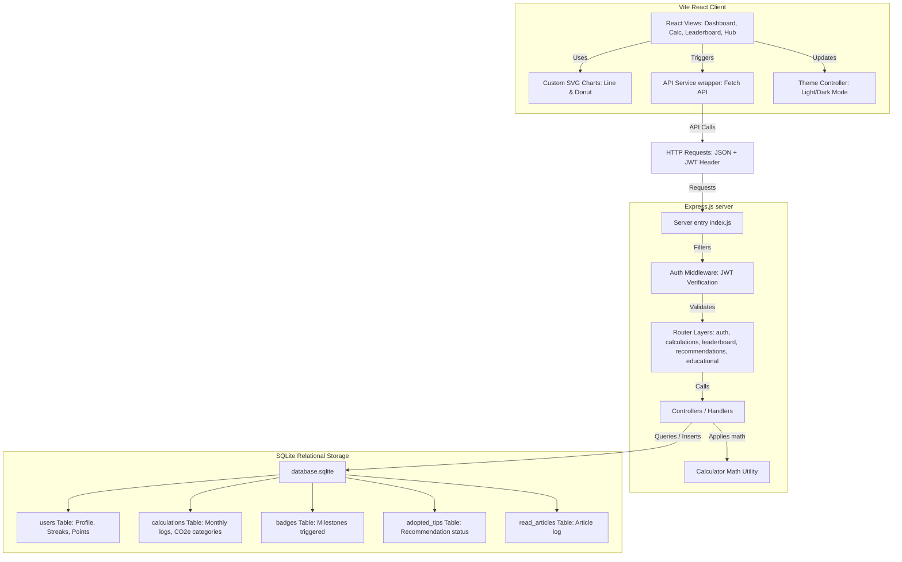

# TerraSense System Architecture

This document outlines the architectural design and structural patterns used in **TerraSense**.

## High-Level Architecture Flow

---

## Component Separation

### 1. Presentation & Views (Frontend/src/pages/)
- **Auth.jsx**: Authenticates credentials, validates input formats, selects sustainability interest tags and reduction goals.
- **Calculator.jsx**: Multi-step wizard form capturing transportation, utilities, diet meals, lifestyle, waste, and water usage. Houses a real-time sidebar previewing emissions.
- **Dashboard.jsx**: Visual analytics displaying line trends, category breakdown donuts, prediction metrics, national averages, printable AI summaries, and ambassador certificates.
- **Leaderboard.jsx**: Displays global community standings and claims points for weekly eco challenges.
- **EducationalHub.jsx**: Modular article reader and collective action impact simulator.
- **Profile.jsx**: Modifies targets and interests. Handles user logouts.

### 2. Business Logic & Integrations
- **Frontend/src/services/api.js**: Core fetch wrapper parsing HTTP responses, handling JWT local storage tokens, and adding authorization headers.
- **Backend/utils/calculator.js**: Decoupled carbon coefficients utility calculating emissions per category (Transport, Utilities, Diet, Waste, Water, Purchases) and returning structured CO2e kg totals.
- **Backend/middleware/auth.js**: Middleware verifying token authorization headers using `jsonwebtoken`.

### 3. Data Schema & Persistence (Backend/models/database.js)
- Runs on a zero-config, single file database `database.sqlite`.
- On startup, automatically builds schemas and seeds initial articles.
- Utilizes relational constraints (e.g. cascading deletes on user profile removal).
